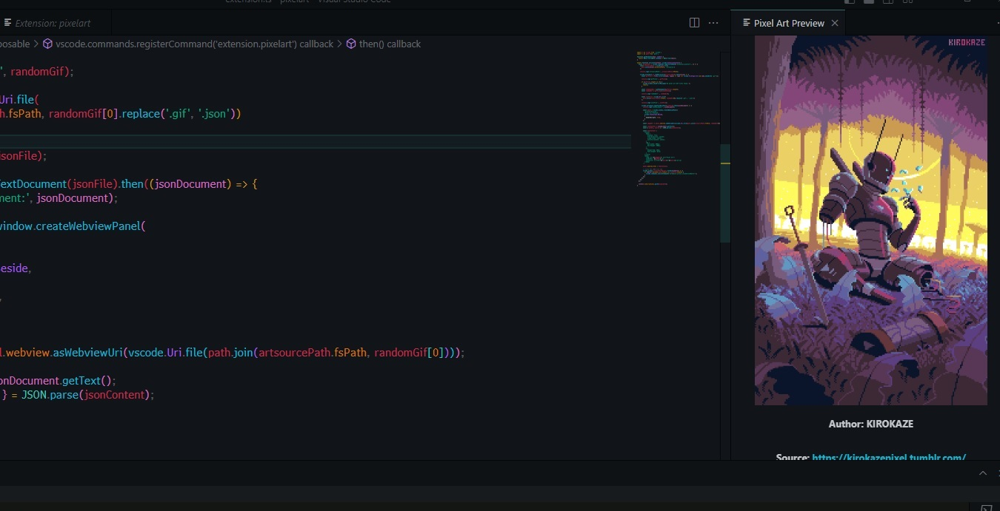
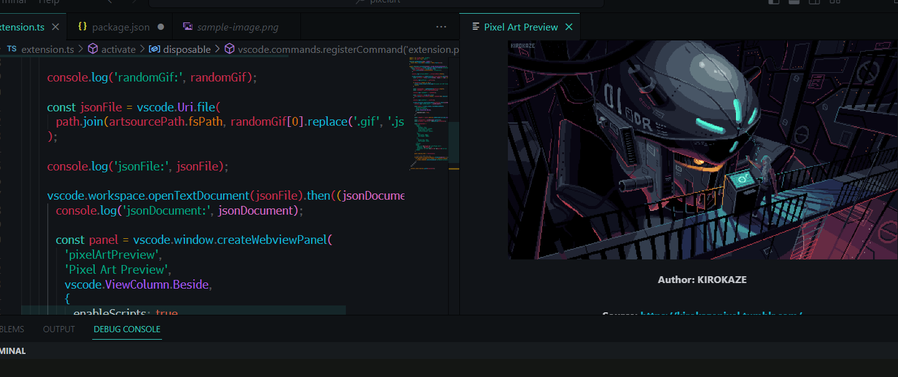
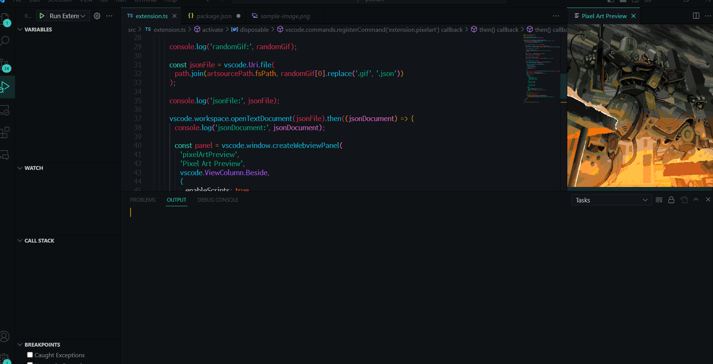

# Pixel Art Extension

The Pixel Art Extension is a Visual Studio Code extension that allows you to preview and display random pixel art GIFs along with their associated metadata.

## Features

- Generates a random pixel art GIF from a collection of files.
- Displays the GIF along with author and source information in a webview panel.
- Clickable source link to directly visit the source website.

## How to use
1. Install: Start by installing the "pixelart" extension from the Visual Studio Code Marketplace.
2. Open Command Palette: Use the keyboard shortcut Ctrl+Shift+P (Windows/Linux) or Cmd+Shift+P (macOS) to open the command palette.
3. Search for "Pixel Art": In the command palette, type "pixelart" and select the "Extension: Pixel Art" command from the suggestions.
4. Execute the Command: Press Enter or click on the "Extension: Pixel Art" command to execute it.
5. Enjoy the Pixel Art: Once the command is executed, a random pixel art GIF will be displayed in a new tab. Take a moment to appreciate the artwork!

## Requirements

- Visual Studio Code version 1.60.0 or higher.

## Extension Settings

This extension does not contribute any specific settings.

## Known Issues

There are no known issues at the moment. Please report any issues you encounter on the [GitHub repository](https://github.com/dunkel000/pixelart).

## Release Notes

### 0.0.1

- Initial release of the Pixel Art Extension.
- Generates a random pixel art GIF.
- Displays the GIF along with author and source information.

### 0.0.2

- Added clickable source link to directly visit the source website.
- Update README and Documentation.

### 0.0.3

- Gif Optimization.
- Update README.

## Contact

For any questions or inquiries, please contact [Diego-Ignacio](mailto:dunkel000@gmail.com).

**Enjoy pixel art!**
